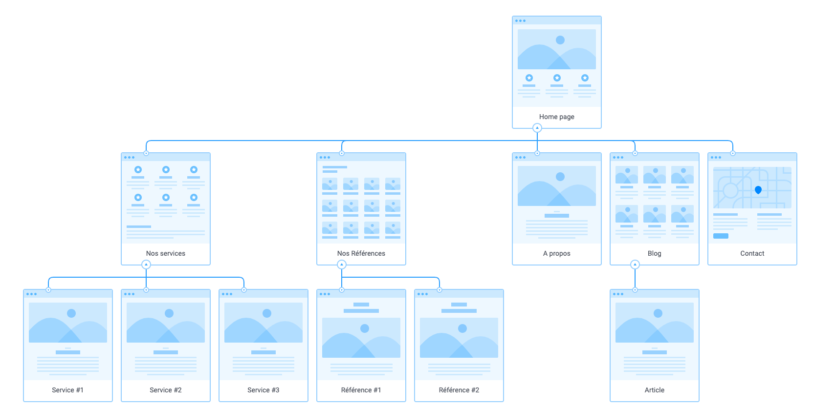

# Les différentes types d’images utilisables :

##  SVG (Scalable Vector Graphics)

Type : Vectoriel.
Utilisation : Graphiques, logos, icônes.
Qualité : Toujours nette, même en zoomant.
Taille de fichier : Variable, souvent petite pour les graphiques simples.
Édition : Facile à modifier.
Compatibilité : Bien supporté par les navigateurs et logiciels de design.
Transparence : Supportée.
Animations : Possible.

##  JPEG (Joint Photographic Experts Group)

Type : Bitmap.
Utilisation : Photographies.
Qualité : Perte de qualité avec la compression.
Taille de fichier : Plus petite grâce à la compression.
Édition : Moins flexible, perte de qualité avec les sauvegardes répétées.
Compatibilité : Très largement supporté.
Transparence : Non supportée.
Animations : Non supportée.

## PNG (Portable Network Graphics)
Compression : Utilise une compression sans perte, ce qui signifie que toutes les données de l'image sont préservées après compression.
Qualité : La qualité de l'image est maintenue, indépendamment du taux de compression.
Utilisation : Idéal pour les images avec des zones de couleur unie, des graphiques, des logos et des illustrations. Particulièrement utile pour les images nécessitant de la transparence.
Transparence : Supporte la transparence (canal alpha).
Extension de fichier : .png.
En résumé, utilisez SVG pour les graphiques nets et évolutifs, et JPEG pour les photos et PNG idéal pour les images nécessitant une haute qualité et de la transparence.

# Etapes de la création de projet et gestion client

Délais : 15 jours, sont 15 jours de travail effectifs non pas 2 semaine, il faut bien quantifier une journée de travail.

1- Entretiens avec les parties prenantes + Priorisation des besoins 

Organisez des réunions avec utilisateurs, équipes internes et partenaires externes pour recueillir leurs attentes et besoins via entretiens individuels, groupes de discussion ou sondages en ligne. Classez ensuite les besoins selon leur importance pour le projet et les ressources disponibles, en utilisant des techniques comme la matrice d’Eisenhower ou la méthode MoSCoW.
2- Arborescence ou plan du site 
Définit l’organisation du contenu et des pages de votre site web ou appli. conçue pour faciliter l’accès aux informations recherchées par les utilisateurs. élément clé pour assurer une expérience utilisateur optimale

- Identification des contenus : Lister tous les types de contenu a inclure ( articles, vidéo, formulaire et produits )
- Organisation des contenus : Regrouper en categories logiques, tenir compte de la manière dont l’utilisateur
navigue sur le site = Rubriques + Sous rubriques = Structure de manière claire et intuitive
- Hiérarchisation des contenus : L’importance relative des contenues à organiser en conséquence, les contenues les plus importants doivent etre facilement accessible

3- Conception UX
 

# Début de leçon

- Toujours nommé son premier fichier comme index, c’est universel et obligatoire pour le navigateur ( c’est la porte d’entrée du site )

- Se servir du zonning en permanance pour produire de manière la plus optimale

- ! + entrée = Structure de base 
<!DOCTYPE html>
<html lang="en"> 
  <head>
    <meta charset="UTF-8">
    <meta name="viewport" content="width=device-width, initial-scale=1.0"> 
    <title>Document</title> 
</head> 
  <body> </body> 
</html>

- meta … =  balise = balise de description ( Ex : cuisine, sport, ou description plus longue ) Information relative au SIO = Référencement Naturelle
- meta charset = attribut qui détermine la façon dont le texte est transmis et stocké ( cela peux changer selon l’endroit Comme Japon, Russie )

- <link rel="stylesheet" href="style.css">
Renvoi vers la feuille de style CSS

- 
Renvoi ver un lien, si pas de lien mettre un #

- <h1> a <h6> Titre par importance

- Il faut y avoir de la reflexion, de la projection avant de coder, diagramme, ressources etc … bien etre préparer avant de coder. S’aider des ellements de zoning qu’on a eu au préalable

- <figure> = contenu autonome, éventuellement accompagné d'une légende facultative, qui est spécifiée à l'aide de l'élément <figcaption>. La figure, sa légende et son contenu sont référencés comme une seule unité.

- <ul> unordoned list représente une liste d'éléments sans ordre particulier. Il est souvent représenté par une liste à puces. Rangé ensuite grace à 
<main> représente le contenu majoritaire du <body> du document. Le contenu principal de la zone est constitué de contenu directement en relation, ou qui étend le sujet principal du document ou de la fonctionnalité principale d'une application.
<form> représente un formulaire, c'est-à-dire une section d'un document qui contient des contrôles interactifs permettant à un utilisateur de fournir des informations.

- Display d’une balise :
c’est le comportement d’une balise = comportement de la balise dans le navigateur, toutes les balises ont un display par défaut, celui-ci peut être modifié au sein d'une feuille de styles. Selon le display une balise aura accès ou non à certaines options de mise en page.

   display :block 
provoquent un retour à la ligne s'empilent les unes sur les autres comme des boîtes occupent toute la largeur de leur conteneur (de la balise qui la (les) contient) peuvent être positionnées sur la page avec position peuvent être dimensionnées avec width, height, min-width, min-height,etc. ont un sens sémantique (sauf 
)

    display:inline
ne provoquent pas de retour à la ligne se placent côte à côte occupent la largeur de leur contenu ne peuvent pas être positionnées sur la page peuvent utiliser la propriété margin, uniquement les marges gauches et droites ne peuvent pas être dimensionnées avec width, height, min-width, min-height,etc. ont un sens sémantique (sauf  et <b>)

    display :flex
Facilite le placement des elements, il considere les elements dans le bloc et va considerer les ellements, il va activer le mode de disposition flexible sur un conteneur, permettant une mise en page plus dynamique et réactive des éléments enfants. Voici une explication détaillée :

Si il y a une sortie dans la balise : 

 Elle contient quelque chose
Si il n’y a pas de sortie dans la balise : 

- Indication portefolio :
  Etre concis, dans le contacter : Contact nom message
  Ne pas tout livrer d’un coup, ajouter de l’interaction, interesser, mettre des bouton call to action

Methode Get = <form action="" method="get"></form>  = GET, les valeurs des champs du formulaire se cumulent dans l'adresse. Cela donne des adresses type : http://www.monsite.com/mapage.php?login=polo&password=123456

Methode Post = <form action="" method="post"></form> = La méthode POST passe les données de manière transparente (pour l'utilisateur) à la page suivante. C'est celle à privilégier tant que possible.

- Ne pas oublier que l’on peux mettre du son ou de la vidéo ou plein de sorte d’interaction : Cf les API

- Chemin absolue (ou URL absolue) est une adresse complète qui spécifie l'emplacement exact d'une ressource sur le web c’est bien pour un lien vers l’exterieur. Les chemins absolus contiennent l’URL complète, incluant le protocole, le nom de domaine du site Web et éventuellement un fichier, sous-dossier ou nom de page spécifique. 
Par exemple : <a href="https://www.codeur.com/page2/">Page 2</a>

- Chemin relatif : uniquement pour les liens internes Un lien relatif quant à lui n’inclut que le nom d’un fichier ou d’une page spécifique, qui est relatif au chemin courant. Si vous conservez tous les fichiers de votre site Web dans un seul répertoire, vous pouvez établir des liens entre les pages comme suit : <a href="page2/">Page 2</a>

* = all par exemple *.jpeg = tous les jpeg

Marging = marge exterieur
padding = marge interieur
 
- Faire attention aux droits ! Polices de caractère, images, son et vidéos

- Utiliser des couleur pour voir ou le header est placé pour le situer

- Display-flex pour appliquer à tous les éléments du conteneur
- Flex sur un élément pour repartir l’espace de chacun 
  1-1-1-1 chaque élément occupe 1 part
  1-2-1-1 l’élément avec flex 2 dispose de deux part les autres d’une part

Question de cours : - plugins compatible pour nous ou pas ?
Inspecteur : afficher les lignes
Récupérer le document sur les display